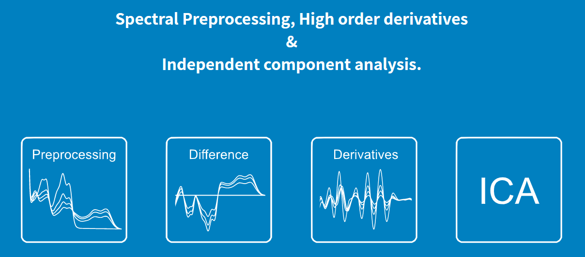
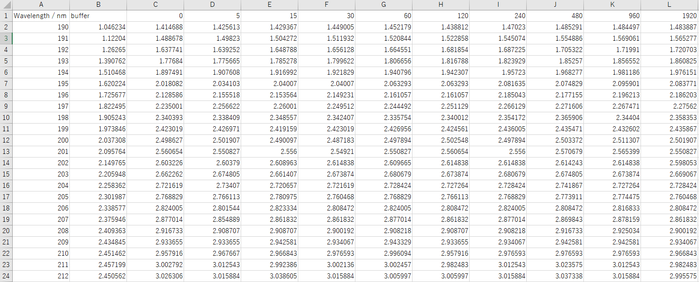

# 

    

## Overview
吸収スペクトルを様々な手法で解析するツールです。

## Requirement
- windows10
- python3.6
- R-4.0.5

## Install
- git clone [Repository URL]
- cd Spectral-Analyzer
- python -m venv myvenv
- myvenv/Scripts/activate
- pip install -r requirements.txt
- python manage.py makemigrations
- python manage.py migrate

## Usage
- Spectral-Analyzer.batをクリック

## Description

### Preprocessing
- 吸収スペクトルのバッファー補正
- 吸収スペクトルの任意の波長のゼロ点補正
- アップロードデータ例 (csv形式)
  

    

  

### Difference
- 吸収スペクトルの差吸収スペクトルの算出
- アップロードデータ例 (csv形式)
  

    

  

### Derivatives
- 吸収スペクトルの微分変換
- 微分スペクトルのスムージング
- アップロードデータ例 (csv形式)
  

    

  

### ICA (Independent Component Analysis)
- スペクトルの独立成分分析
- アップロードデータ例 (csv形式)
  

    

  

