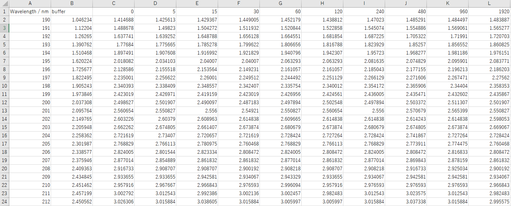
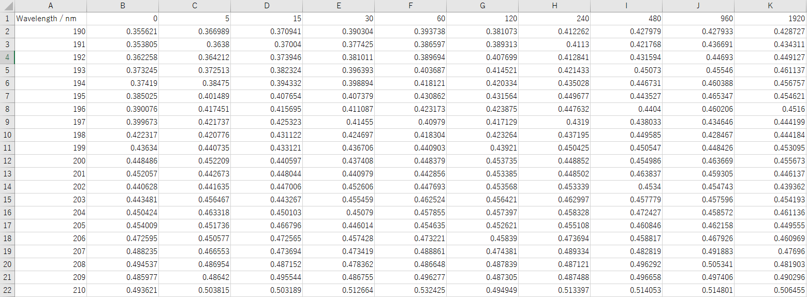

Name
===
spectral-analyzer 

Overview
===
吸収スペクトルを様々な手法で解析するツールです。


Requirement
===
- Docker Desktop (Windows10, macOS)
  - Windows10の場合  
https://qiita.com/zaki-lknr/items/db99909ba1eb27803456
  - macOSの場合  
https://docs.docker.jp/docker-for-mac/install.html


Install
===
```
$ git clone [Repository URL]
$ cd spectral-analyzer
$ docker-compose up -d --build
```

Usage
===
http://127.0.0.1:8000/


Description
===

## Preprocessing
- 吸収スペクトルのバッファー補正
- 吸収スペクトルの任意の波長のゼロ点補正
- アップロードデータ例 (csv形式)
  <div align="left">
    <p></p>
  </div>

## Difference
- 吸収スペクトルの差吸収スペクトルの算出
- アップロードデータ例 (csv形式)
  <div align="left">
    <p></p>
  </div>
## Derivatives
- 吸収スペクトルの微分変換
- 微分スペクトルのスムージング
- アップロードデータ例 (csv形式)
  <div align="left">
    <p></p>
  </div>
## ICA (Independent Component Analysis)
- スペクトルの独立成分分析
- アップロードデータ例 (csv形式)
  <div align="left">
    <p></p>
  </div>


